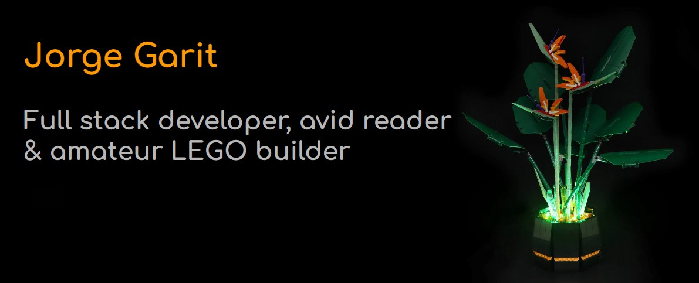

## Hello I'm Jorge 🥸 🖥️

I am a full stack web developer who is just starting his journey into the exciting world of coding. I am passioante aboout creating fully functioning, dynamic websites that are approachable, engaging, and inclusive. I enjoy working with JavaScript, MySQL, ReactJS, and Node.js. I am also very excited to learn more and familiarize myself with both Python and Ruby. 

At the current moment I am working with a group of other talented developers on a privacy first photo jounaling application called <a href="https://salty-forest-28898.herokuapp.com/login" target="_blank">Journify</a> 

### Call me beep me if you want to reach me 

<!--
**jorgegarit/jorgegarit** is a ✨ _special_ ✨ repository because its `README.md` (this file) appears on your GitHub profile.

Here are some ideas to get you started:

- 🔭 I’m currently working on ...
- 🌱 I’m currently learning ...
- 👯 I’m looking to collaborate on ...
- 🤔 I’m looking for help with ...
- 💬 Ask me about ...
- 📫 How to reach me: ...
- 😄 Pronouns: ...
- ⚡ Fun fact: ...
-->
